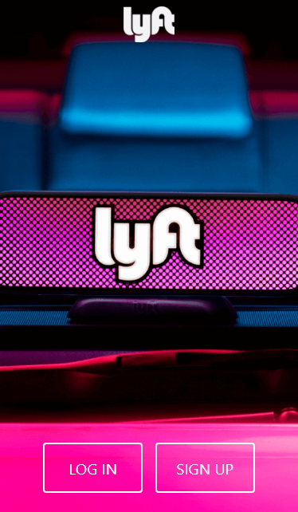
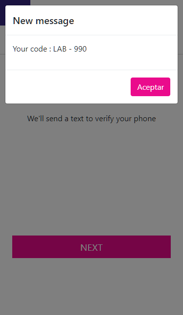
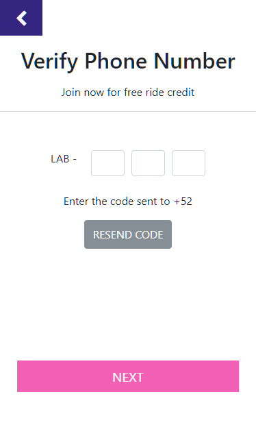
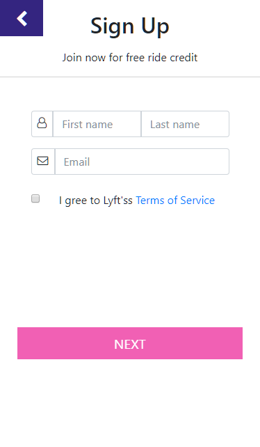
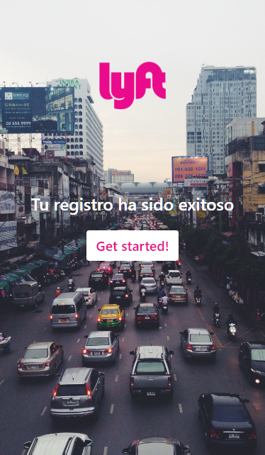

### LYFT MOBILE 

#### OBJETIVO:
Desarrollar una web-app que replique el sitio de Lyft al momento de registrarse, como se muestra a continuación:
 

 

 

  

  

  

#### DETALLES DEL REPOSITORIO:
+ Para la visualización de las diversas vistas se crearon para cada una un archivo *html*. Todas las vistas se encuentran en la carpeta *views*.
+ Para la funcionalidad en cada archivo se creo archivos *javascript* independientes para cada vista.
+ Tambien se creo un archivo *app.js* en el cual se encuentran las diversas funcionalidades que fueron utilizadas en más de una vista del proyecto.
+ Se utilizaron íconos de *font-awesome*.
+ Se utilizó el framework *BOOTSTRAP* para el diseño y los modales incluidos en el proyecto.

